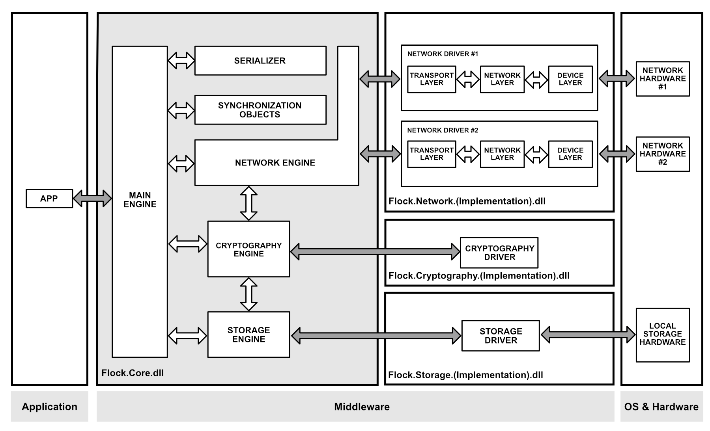

# Summary

Flock is a lightweight middleware under development, using C# and .NET Standard 2.0.
This code has been produced for obtaining a bachelor's degree in Computer Science.
The middleware allows data exchange between nodes of a peer-to-peer network.
Using the concept of CRDT (Conflict-free replicated data type), the middleware decouples the application layer from the network layer, while exposing an easy API to communicate with other nodes using a set of available Data Models.

# Block Diagram



# Usage Example

```
var config = new FlockConfigurationDefault();
var middleware = new FlockMiddleware(config);
var localNode = new Node(UniqueIdFactory.CreateNew());

using (var client = middleware.CreateClient(localNode, Group.World)) {

    var counterId = UniqueIdFactory.CreateNew();
    var counter = client.GetCounter(counterId);

    counter.Increment();
}
```

# Project Progress

-  [x] CRDT research
-  [x] Architecture and code structure
-  [x] Implementation of the proof of concept
-  [x] Paper and presentation
-  [ ] Network DTO optimization using delta of the model states
-  [ ] Improvement, by adding extra data models

# Author

**Giovani Luigi R. Brondani**
